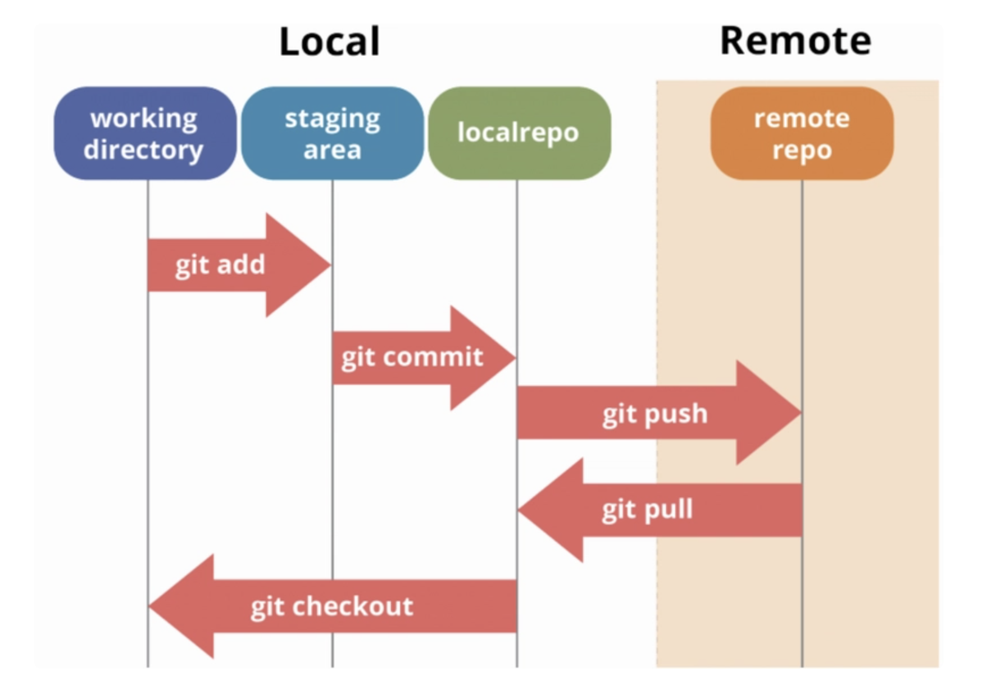

# Git & GitHub Workshop – Versionskontrolle verstehen und anwenden

---

## Einführung

Git ist ein Werkzeug zur Versionskontrolle. Es hilft dir, Änderungen an Dateien wie Code oder Dokumenten nachvollziehbar zu machen, frühere Versionen wiederherzustellen und effizient im Team zusammenzuarbeiten.  
Statt Dateien wie `version_final_final2.docx` zu speichern, übernimmt Git die Verwaltung für dich – sicher, nachvollziehbar und strukturiert.

In diesem Workshop lernst du, wie Git funktioniert, wie du es einrichtest und gemeinsam mit GitHub zur Online-Zusammenarbeit nutzt.

---

## Was ist Git?

Git ist ein lokales Versionskontrollsystem, das Änderungen an Dateien nachvollziehbar macht.

Es ermöglicht:

- Rücksprung zu früheren Versionen  
- Zusammenarbeit ohne Konflikte  
- Nachvollziehbarkeit von Änderungen  
- Sicherheit durch lokale Sicherung  

Wird oft für Code, aber auch für Dokumente und Webseiten genutzt.

---

## Git – Erste Schritte

### Installation

**Git prüfen:**
```bash
git --version
```

**Installation auf macOS (mit Homebrew):**

1. [brew.sh](https://brew.sh) installieren  
2. Terminal:
```bash
brew install git
```

---

### Grundkonfiguration

```bash
git config --global user.name "Dein Name"
git config --global user.email "deine@email.de"
```

---

### Repository anlegen & nutzen

```bash
git init                     # Neues Git-Repo starten  
git status                   # Änderungen anzeigen  
git add datei.txt            # Datei vormerken  
git add .                    # alle Dateien vormerken
git commit -m "Nachricht"    # Änderungen speichern  
```

---

### Änderungen übertragen

```bash
git remote add origin <ssh-url>  # Verbindung zu GitHub  
git push                         # Änderungen hochladen  
git pull                         # Änderungen herunterladen  
```

---

### Typischer Workflow

1. Lokales Repo mit `git init` starten oder mit `git clone` klonen  
2. Dateien ändern  
3. Änderungen mit `git add` vormerken  
4. Mit `git commit` speichern  
5. Mit `git push` auf GitHub hochladen  

---

## GitHub

- Cloud-Plattform für Git-Repositories  
- Erlaubt Zusammenarbeit, Versionsverwaltung und Austausch  
- Gehört zu Microsoft  

---

### SSH-Key hinterlegen (einmalig)

```bash
# Key anzeigen
cat ~/.ssh/id_rsa.pub

# Falls kein Key vorhanden
ssh-keygen -t rsa -b 4096 -C "deine@email.de"
```

Den öffentlichen Schlüssel unter [github.com/settings/keys](https://github.com/settings/keys) einfügen.

---

### GitHub Repo erstellen & verbinden

1. Auf GitHub: "New Repository"  
2. Im Terminal:
```bash
git remote add origin git@github.com:username/repo.git
git push -u origin main
```

---

### Collaborator einladen

1. Repository → Settings → Collaborators → Person hinzufügen

---

## Erweiterte Befehle

### Repository klonen

```bash
git clone <ssh-url>
```

---

### Branches

```bash
git branch                    # Branches anzeigen  
git checkout -b neuerBranch  # Neuen Branch erstellen / wechsel in den neune erfolgt automatisch 
git checkout main            # Zum Haupt-Branch wechseln 
git checkout neuerBranch     # Zum neuenBranch-Branch wechseln, wenn dieser bereits erstellt ist
git merge neuerBranch        # Branch zusammenführen  
```

---

### Verlauf & Reset

```bash
git log                      # Detaillierter Verlauf  
git log --oneline            # Kurzformat  
git checkout <commit-hash>   # Temporär alten Stand laden  
git reset --hard <hash>      # Änderungen verwerfen  
git reset --soft <hash>      # Änderungen behalten  
git checkout -b test <hash>  # Test-Branch vom alten Stand  
```

---

### .gitignore

`.gitignore`-Datei erstellen, z. B.:

```
node_modules/
*.log
.DS_Store
```

Zum Erstellen einer `.gitignore` kann auch eine LLM (z. B. ChatGPT) verwendet werden.

---

## Visual Studio Code (VSCode)

- `Ctrl + Shift + P` → "Preferences: Open Settings"  
- `Files: Auto Save` aktivieren  

---

## Python: Virtual Environment

```bash
# macOS / Linux
python3 -m venv .venv
source .venv/bin/activate

# Windows PowerShell
Set-ExecutionPolicy -Scope CurrentUser -ExecutionPolicy RemoteSigned
.\.venv\Scripts\activate
```

---

## Git & GitHub im Zusammenspiel

1. Lokal mit Git arbeiten  
2. GitHub-Repo erstellen  
3. Lokal mit `remote add` verbinden  
4. Mit `push` hochladen / `pull` Änderungen holen  
5. GitHub nutzen für:

   - Pull Requests  
   - Kommentare & Code-Review  
   - Zusammenarbeit  

---

## Python: requirements.txt erstellen und nutzen

In Python-Projekten listet die Datei `requirements.txt` alle benötigten Pakete und deren Versionen auf, damit andere (oder du selbst später) die Entwicklungsumgebung genau reproduzieren können.

### So erstellst du die Datei:

```bash
pip freeze > requirements.txt
```

Das speichert alle aktuell installierten Pakete mit Versionsnummern in die Datei.

### So installierst du die Abhängigkeiten später:

```bash
pip install -r requirements.txt
```

Das installiert alle benötigten Pakete automatisch.

**Vorteil:** Dein Projekt wird portabel und teamfähig – alle verwenden die gleiche Paketbasis.

---

## Prozessdiagramm



---

## Weitere Tutorials & Hilfeseiten

- [git@github.com:Locke-SH/git_intro.git](https://github.com/kuahyeow/git-workshop)  
- [https://git-scm.com/doc](https://git-scm.com/doc) (offizielle Git-Dokumentation)  
- [Git Cheat Sheet (PDF)](https://education.github.com/git-cheat-sheet-education.pdf)